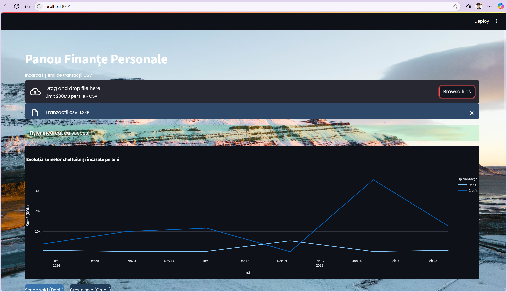
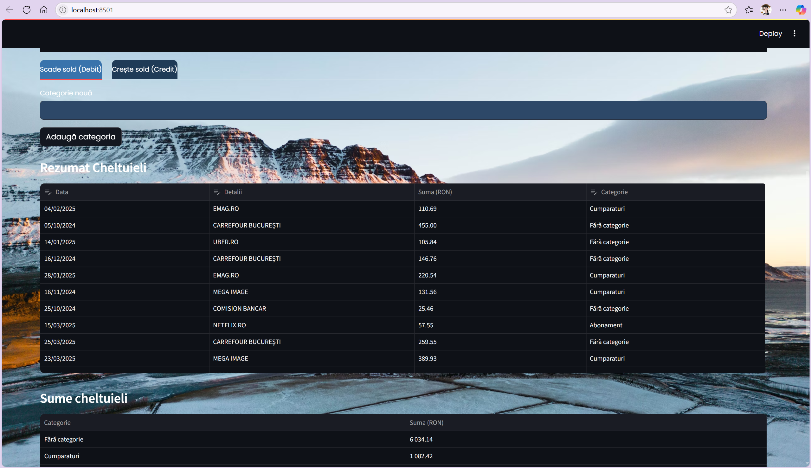
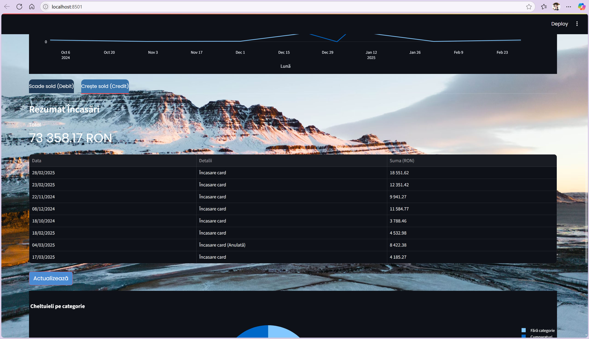
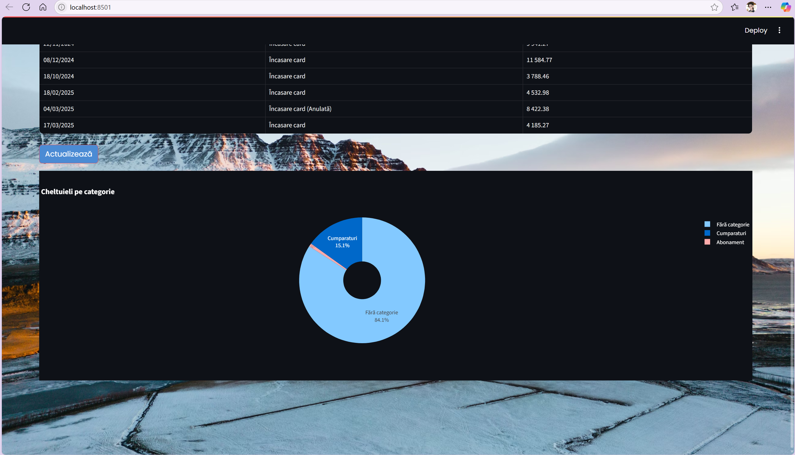

<h1 style="text-align:center; font-weight: 700; margin-bottom: 0.2rem;">EN-Personal Finance App with Streamlit</h1>

  Manage and visualize your personal finances easily with Python, Streamlit, and Plotly.

<h2 style="color: #e0c3fc;"> Features</h2>
<ul>
  <li>Upload CSV files with Debit/Credit bank transactions</li>
  <li>Automatic data cleaning and preprocessing</li>
  <li>Auto-categorization of expenses based on keywords</li>
  <li>Add and edit categories and keywords in-app</li>
  <li>Interactive monthly spending and income charts with Plotly</li>
  <li>Pie chart showing expenses breakdown by category</li>
  <li>Custom styled UI with Google Fonts and purple-themed CSS</li>
  <li>Categories saved locally in JSON for persistence</li>
</ul>

<h2 style="color: #d4b9fc;"> Getting Started</h2>
<pre style="background: #5c3db1; padding: 1rem; border-radius: 8px; overflow-x: auto;">
<code style="color: #f0e9ff;">

pip install streamlit pandas plotly
streamlit run app.py
</code>
</pre>

<h2 style="color: #d4b9fc;"> CSV File Format</h2>

The CSV file should contain the following columns:

<table style="width:100%; border-collapse: collapse; margin-bottom: 1rem;">
  <thead>
    <tr style="background-color: #6c4fd8; color: white;">
      <th style="padding: 8px; border: 1px solid #5c3db1;">Data</th>
      <th style="padding: 8px; border: 1px solid #5c3db1;">Detalii</th>
      <th style="padding: 8px; border: 1px solid #5c3db1;">Suma (RON)</th>
      <th style="padding: 8px; border: 1px solid #5c3db1;">Monedă</th>
      <th style="padding: 8px; border: 1px solid #5c3db1;">Tip tranzacție</th>
      <th style="padding: 8px; border: 1px solid #5c3db1;">Stare</th>
    </tr>
  </thead>
  <tbody>
    <tr style="background-color: #8c68f9; color: white;">
      <td style="padding: 8px; border: 1px solid #5c3db1;">28.02.2025</td>
      <td style="padding: 8px; border: 1px solid #5c3db1;">Încasare card</td>
      <td style="padding: 8px; border: 1px solid #5c3db1;">"18.551,62"</td>
      <td style="padding: 8px; border: 1px solid #5c3db1;">RON</td>
      <td style="padding: 8px; border: 1px solid #5c3db1;">Credit</td>
      <td style="padding: 8px; border: 1px solid #5c3db1;">Decontată</td>
    </tr>
    <tr style="background-color: #9a7efc; color: white;">
      <td style="padding: 8px; border: 1px solid #5c3db1;">15.02.2025</td>
      <td style="padding: 8px; border: 1px solid #5c3db1;">COMISION BANCAR</td>
      <td style="padding: 8px; border: 1px solid #5c3db1;">"137,95"</td>
      <td style="padding: 8px; border: 1px solid #5c3db1;">RON</td>
      <td style="padding: 8px; border: 1px solid #5c3db1;">Debit</td>
      <td style="padding: 8px; border: 1px solid #5c3db1;">Decontată</td>
    </tr>
  </tbody>
</table>

<i>Notes:</i>

<ul>
  <li><b>Data:</b> format day.month.year (e.g., 28.02.2025)</li>
  <li><b>Suma (RON):</b> decimal separator is comma, thousand separator is dot (e.g., "18.551,62")</li>
  <li><b>Tip tranzacție:</b> must be either <code>Debit</code> or <code>Credit</code></li>
  <li><b>Stare:</b> transaction status (e.g., Decontată)</li>
</ul>

<h2 style="color: #d4b9fc;"> Usage</h2>

Upload your CSV file with transactions. The app will automatically clean and categorize your data. You can also add or edit categories and keywords to better fit your needs. Visualize your financial trends and get detailed breakdowns.

<h2 style="color: #d4b9fc;"> Customizations &amp; Extensions</h2>

<ul>
  <li><strong>Add new categories and keywords</strong> directly in-app to improve automatic transaction categorization.</li>
  <li>Categories are saved locally in <code>category_of_expenses.json</code> to <em>persist</em> between sessions and keep your data consistent.</li>
  <li>The UI is <strong>custom styled</strong> with injected CSS in Streamlit, providing a clean and visually pleasing experience themed design.</li>
  <li>Interactive charts use <strong>Plotly</strong> to deliver smooth and modern visualizations for your financial data.</li>
  <li>The codebase is easily extendable with features like:
    <ul>
      <li>PDF export of reports</li>
      <li>Financial alerts and notifications</li>
      <li>Bank API integrations for automatic transaction fetching</li>
      <li>And much more!</li>
    </ul>
  </li>
</ul>

<h2 style="color: #d4b9fc;"> Inspiration</h2>

This project is inspired by <a href="https://www.youtube.com/watch?v=wqBlmAWqa6A" target="_blank" style="color:#f0e9ff; text-decoration: underline;">Tech With Tim's tutorial</a> and the <a href="https://github.com/techwithtim/AutomateFinancesWithPython" target="_blank" style="color:#f0e9ff; text-decoration: underline;">AutomateFinancesWithPython</a> repository, adapted with new features and Romanian localization.

##  Demo

  

  

  

  

  

 

  

  

<h1 style="color:#7e57c2;">RO-Aplicație pentru Finanțe Personale cu Streamlit</h1>

Gestionează și vizualizează-ți finanțele personale simplu, folosind Python, Streamlit și Plotly.

---

<h2 style="color:#673ab7;"> Funcționalități</h2>
<ul>
  <li>Încarcă fișiere CSV cu tranzacții bancare Debit/Credit</li>
  <li>Curățare și preprocesare automată a datelor</li>
  <li>Auto-categorizare a cheltuielilor pe baza cuvintelor cheie</li>
  <li>Adaugă și editează categorii și cuvinte cheie direct în aplicație</li>
  <li>Grafice interactive lunare pentru cheltuieli și încasări cu Plotly</li>
  <li>Diagramă tip <em>pie</em> pentru analiza cheltuielilor pe categorii</li>
  <li>Interfață personalizată cu Google Fonts și stil CSS pe tema mov</li>
  <li>Categoriile sunt salvate local în JSON pentru persistenta datelor</li>
</ul>

---

<h2 style="color:#673ab7;"> Pornire rapidă</h2>
<pre style="background:#ede7f6; padding:10px; border-radius:6px;">
<code>pip install streamlit pandas plotly
streamlit run app.py
</code>
</pre>

---

<h2 style="color:#673ab7;"> Formatul fișierului CSV</h2>

Fișierul CSV trebuie să conțină următoarele coloane:

<table style="border-collapse: collapse; width: 100%; color:#4a148c;">
  <thead style="background:#d1c4e9;">
    <tr>
      <th style="border: 1px solid #b39ddb; padding: 8px;">Data</th>
      <th style="border: 1px solid #b39ddb; padding: 8px;">Detalii</th>
      <th style="border: 1px solid #b39ddb; padding: 8px;">Suma (RON)</th>
      <th style="border: 1px solid #b39ddb; padding: 8px;">Monedă</th>
      <th style="border: 1px solid #b39ddb; padding: 8px;">Tip tranzacție</th>
      <th style="border: 1px solid #b39ddb; padding: 8px;">Stare</th>
    </tr>
  </thead>
  <tbody style="background:#ede7f6;">
    <tr>
      <td style="border: 1px solid #b39ddb; padding: 8px;">28.02.2025</td>
      <td style="border: 1px solid #b39ddb; padding: 8px;">Încasare card</td>
      <td style="border: 1px solid #b39ddb; padding: 8px;">"18.551,62"</td>
      <td style="border: 1px solid #b39ddb; padding: 8px;">RON</td>
      <td style="border: 1px solid #b39ddb; padding: 8px;">Credit</td>
      <td style="border: 1px solid #b39ddb; padding: 8px;">Decontată</td>
    </tr>
    <tr>
      <td style="border: 1px solid #b39ddb; padding: 8px;">15.02.2025</td>
      <td style="border: 1px solid #b39ddb; padding: 8px;">COMISIONN BANCAR</td>
      <td style="border: 1px solid #b39ddb; padding: 8px;">"137,95"</td>
      <td style="border: 1px solid #b39ddb; padding: 8px;">RON</td>
      <td style="border: 1px solid #b39ddb; padding: 8px;">Debit</td>
      <td style="border: 1px solid #b39ddb; padding: 8px;">Decontată</td>
    </tr>
  </tbody>
</table>

<strong>Note:</strong>

<ul>
  <li><strong>Data:</strong> format zi.lună.an (ex: 28.02.2025)</li>
  <li><strong>Suma (RON):</strong> separator zecimal virgulă, separator mii punct (ex: "18.551,62")</li>
  <li><strong>Tip tranzacție:</strong> trebuie să fie <code>Debit</code> sau <code>Credit</code></li>
  <li><strong>Stare:</strong> statusul tranzacției (ex: Decontată)</li>
</ul>

---

<h2 style="color:#673ab7;"> Utilizare</h2>

Încarcă fișierul CSV cu tranzacții. Aplicația curăță și categorizează automat datele. Poți adăuga sau modifica categoriile și cuvintele cheie pentru o personalizare mai bună. Vizualizează tendințele financiare și analize detaliate.

---

<h2 style="color:#673ab7;"> Personalizări și Extensii</h2>
<ul>
  <li>Adaugă categorii și cuvinte cheie direct în aplicație pentru o auto-categorizare mai precisă.</li>
  <li>Categoriile sunt salvate local în <code>category_of_expenses.json</code> pentru a păstra consistența între sesiuni.</li>
  <li>Interfața este personalizată cu CSS injectat în Streamlit, oferind o experiență vizuală plăcută.</li>
  <li>Graficele interactive folosesc Plotly pentru vizualizări moderne și fluide ale datelor tale financiare.</li>
  <li>Codul poate fi extins cu funcționalități precum:
    <ul>
      <li>Export PDF al rapoartelor</li>
      <li>Alerte și notificări financiare</li>
      <li>Integrare API bancar pentru descărcarea automată a tranzacțiilor</li>
      <li>Și multe altele!</li>
    </ul>
  </li>
</ul>

---

<h2 style="color:#673ab7;"> Inspirație</h2>

Proiectul este inspirat de tutorialul <a href="https://www.youtube.com/watch?v=wqBlmAWqa6A" style="color:#9575cd;">Tech With Tim</a> și repository-ul <a href="https://github.com/techwithtim/AutomateFinancesWithPython/tree/main" style="color:#9575cd;">AutomateFinancesWithPython</a>, adaptat cu funcționalități noi și localizare în limba română.

